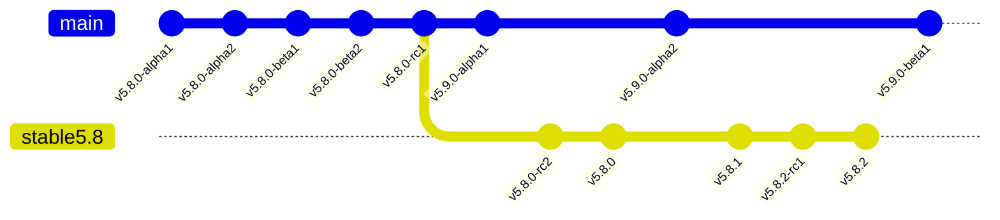

# Groupware App Branching Strategy

This document gives an overview of how git branches and tags are used for Groupware apps.

## Versioning

All modifications go into `main` first. `main` is used for all pre-releases. At RC1, a *stable branch* is created from HEAD of `main`. `main` targets the next minor or major release after this branch-off. The stable branch is used to finalize the stabilization of the minor/major release. Once the first .0 version is out, all future patch releases are created from the stable branch directly. If there is a pre-release for a patch release, it's done on the stable branch directly (v5.8.2 below).

